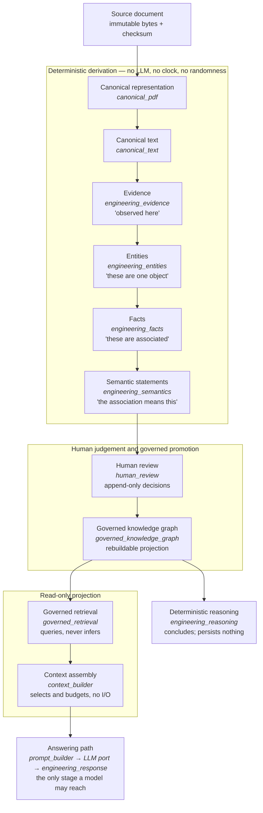

# SubstationOS

**An engineering operating system for high-voltage and medium-voltage substations.**

Commissioning a substation means working across hundreds of documents: single-line
diagrams, functional and protection schematics, relay setting sheets, cable
schedules, factory and site test reports, client specifications, standards. They
arrive in different formats, from different vendors, in different revisions, and
they disagree with each other more often than anyone likes to admit.

Answering one concrete question — *which CT ratio was specified for this bay, and
does the relay setting actually match it?* — means opening five documents and
trusting your memory for the rest. Getting it wrong does not produce a bad user
experience; it produces a protection scheme that does not trip.

SubstationOS ingests that documentation, organises it per installation, and turns
it into a queryable engineering record where every statement traces back to a
document, a page and a character range — and where nothing an engineer has not
reviewed reaches the answerable graph.

It is built by a field commissioning engineer, against the problem as it actually
shows up on site.

---

## What it does today

Given a PDF belonging to a project, the system derives, in strictly ordered stages:

1. a **canonical representation** of the document — pages, blocks, spans;
2. **canonical text** — pages, paragraphs, lines, tokens, with stable coordinates;
3. **evidence** — observed reference designations, engineering quantities and
   location aspects, each carrying character-level provenance;
4. **entities** — observations grouped into the objects they refer to;
5. **facts** — governed associations between entities;
6. **semantic statements** — the governed meaning of those associations.

Every one of those stages is **deterministic**: a pure function of the upstream
artifact and the versioned rule catalogues that produced it. No language model, no
clock, no randomness. That is not a convention anyone is asked to remember — an
architecture test walks every module of every stage and fails the build on a
forbidden import.

A semantic statement then reaches a **human engineer**, who approves it, rejects it,
or marks it inconclusive. Only approved statements are projected into the
**governed knowledge graph**, and only that graph may be read by the query path.

Language models enter after that boundary, and only to classify a question and
compose prose from knowledge the graph has already returned. They never author
engineering truth, and they cannot reach any stage of the derivation.

---

## The governed pipeline



Six separations are real boundaries in code, each guarded by a test:

| Not the same as | Why it matters |
|---|---|
| Evidence ≠ Entity | An observation is not a claim that two observations are one object. |
| Entity ≠ Fact | An object is not an association between objects. |
| Fact ≠ Semantic statement | An association is not its meaning. |
| Semantic statement ≠ Review decision | Engineering truth is not engineering judgement. |
| Approved statement ≠ The graph | The graph is a rebuildable projection, not the source of truth. |
| Retrieval ≠ Inference | Retrieval answers what is stored; it never derives. |

---

## Project-centric domain model

Two bodies of knowledge are deliberately kept apart:

- **Canonical Domain** — the versioned electrical vocabulary of what *can* exist:
  68 equipment definitions across 8 categories plus 18 attribute definitions,
  authored as reviewable YAML rather than code, so an engineer who does not read
  Python can still audit the ontology. It is the same for every installation.
- **Project Knowledge** — what *does* exist at one installation, according to that
  project's own documents at that project's own revisions.

Everything derived is scoped to a project. There is no global entity soup: `-QA1`
in one substation is not `-QA1` in another, and the model never pretends otherwise.

Designations are read in the reference-designation grammar engineers already use
(IEC 81346):

```
-QA1          product aspect  — a circuit breaker
+E01          location aspect — a bay or cubicle
+E01-QA1      compound reference designation: -QA1 in the context of +E01
-E1.L         dot-qualified product aspect — one atomic designation; the dot is
              lexical and creates no parent/child hierarchy
52-Q1         numeric function code
```

The extractor is deliberately conservative. Not every capitalised token is a
designation, and the cost of being wrong is asymmetric: a missed designation is a
gap a later rule can close, while a false one becomes an object an engineer has to
spend time disproving.

---

## Evidence and provenance

The governing rule is that a wrong answer is worse than a visible error.

- **Nothing is asserted without a source.** Every piece of evidence carries page,
  paragraph, line, token range and character range in the canonical text, back to a
  document identified by content checksum.
- **Every derived artifact carries the identity of the computation that produced
  it** — a hash of the identity contract, the artifact kind, the full upstream
  identity and the local derivation identity. A stage names only the rule versions
  it owns; everything above reaches it through one upstream identity. A parser
  upgrade or a rule-version bump therefore invalidates everything downstream by
  construction rather than by anyone remembering to update a column, and re-use is
  a single identity comparison the database constraint also encodes.
- **Judgement never rewrites truth.** Approving a statement does not modify it;
  rejecting does not delete it. Review is an append-only ledger, and the
  deterministic pipeline cannot read a review. The boundary is enforced from both
  sides.
- **Identity attaches to actions, not artifacts.** No derived artifact carries a
  user id, so running the pipeline as two different engineers produces identical
  results; *who ran it* is recorded on the audit event instead.
- **Extraction quality is measured, not asserted.** A hand-annotated reference
  corpus — written by reading the documents, never by recording what the extractor
  produced — pins the current baseline at precision 0.917 and recall 0.971. Known
  false positives and the known recall gap are annotated *in* the corpus rather
  than suppressed, so a rule change that hides a defect fails the build instead of
  improving the number.

---

## Current capabilities

**Documents and projects** — project workspaces; document registry, ingestion,
content-checksum identity, explicit project versus canonical-library scoping; PDF
text extraction into canonical representation and canonical text.

**Deterministic derivation** — evidence extraction for reference designations,
engineering quantities (voltage, current, power, cable section) and IEC 81346
location aspects, every match traceable to one declared pattern; entity resolution
within a document across three entity types; fact construction under governed rules
(`has_associated_quantity`, `has_location_aspect`); semantic statements
(`has_rated_power`, `is_located_in`); artifact re-use across re-runs by identity
comparison.

**Governance** — append-only human review with identity-based revalidation; a
governed knowledge graph written by exactly one application authority, with no API
route able to bypass promotion.

**Reading and answering** — governed retrieval by asset designation, asset quantity,
relationship and document knowledge, read-only, returning provenance and a match
explanation; context assembly that selects and budgets what retrieval returned and
performs no I/O; deterministic reasoning over the governed graph (quantity
consistency, shared structural location) returning `consistent` / `inconsistent` /
`insufficient_knowledge` / `ambiguous` with a rule identity and an inference path,
never persisted and never promoted.

**Platform** — 114 HTTP endpoints across 30 routers with an exported OpenAPI
contract the web client is tested against; session-cookie authentication with CSRF
protection enforced by middleware, so a route added later is protected by default;
role-based authorization as a pure function of role and capability; an audit trail
keyed to actions; a Next.js engineering workspace with a source viewer and canonical
page map, explorers for evidence, entities, facts and semantics, a review panel and
timeline, a pipeline inspector and a project knowledge-graph view.

---

## Technology stack

| Layer | Choice |
|---|---|
| Backend | Python 3.13+, FastAPI, SQLAlchemy, Alembic |
| PDF parsing | PyMuPDF, behind a domain-owned parser port |
| Domain data | YAML, safe-loaded, reviewable without reading Python |
| Database | SQL, schema owned by Alembic (17 migrations); SQLite in development |
| LLM | Anthropic, behind `LlmProviderPort`; disabled by default |
| Frontend | Next.js 16, React 19, TypeScript, Tailwind CSS, React Flow |
| Tests | pytest (backend), Vitest and Testing Library (frontend) |

Every infrastructure choice sits behind a domain-owned port and is meant to be
replaceable without touching the domain. The domain layer imports nothing but the
standard library and other domain modules, and an architecture test enforces it.

---

## Repository structure

```
apps/backend/            Python / FastAPI backend — the primary application
  app/domain/            33 domain packages: entities, value objects, rules, ports
  app/application/       provider-neutral LLM contracts, policies, runtime
  app/infrastructure/    adapters: PDF parser, YAML loaders, repositories, LLM
  app/services/          use-case orchestration, one service per pipeline stage
  app/routers/           HTTP endpoints
  app/models/            ORM models
  migrations/            Alembic migrations
  tests/                 domain, services, api, infrastructure, architecture
apps/frontend/           Next.js engineering workspace
docs/architecture/       Architecture Freeze v1.0 and long-form references
docs/architecture/adr/   33 Architecture Decision Records
docs/ai-context/         derived navigation layer, regenerated rather than authored
knowledge/               Canonical Knowledge Protocol and extraction methodology
scripts/, tools/         operational scripts and PDF tooling
storage/                 local artifact storage — excluded from version control
```

---

## Local setup

| Prerequisite | Version | Why |
|---|---|---|
| Python | 3.13+ | Declared by `apps/backend/pyproject.toml`; the suite is verified on 3.13 and 3.14 |
| Node.js | 24.15+ | Declared by `apps/frontend/package.json`; `jsdom` sets the floor |

A green backend suite needs no database server, no AI credential and no network.

**Backend.**

```bash
cd apps/backend
python -m venv .venv
source .venv/bin/activate        # Windows: .venv\Scripts\activate
pip install -e ".[dev,server]"

cp .env.example .env             # every line may stay blank
alembic upgrade head             # `alembic stamp head` for an existing dev database
python -m pytest
uvicorn app.main:app --reload --host localhost    # http://localhost:8000
```

Run backend commands from `apps/backend/`. The development database is
`sqlite:///./substationos.db`, resolved against the working directory, so the
directory you are in decides which database you are talking to.

**Serve the API on `localhost`, not `127.0.0.1`.** The session cookie is
`SameSite=Lax`, and although ports are ignored, `localhost` and `127.0.0.1` are
different hosts. Serve it from the host the frontend expects, or every request
arrives anonymous with no error to read.

The schema is owned by Alembic and never by application startup: an unmigrated
database fails loudly at first query rather than being silently patched into shape.

**No API key is required to run the pipeline.** Canonical representation, canonical
text, evidence, entities, facts, semantics, review, promotion, retrieval, context
assembly and reasoning all run with no AI provider configured. `LLM_RUNTIME_ENABLED`
defaults to `false`, so no project content leaves the process unless you explicitly
enable it and supply a credential.

**Frontend.**

```bash
cd apps/frontend
npm ci                           # `npm install` only when changing dependencies
npm run dev                      # http://localhost:3000

npm test                         # vitest
npm run typecheck                # tsc --noEmit
npm run lint                     # eslint
npm run build                    # next build
```

Configuration is one variable, `NEXT_PUBLIC_API_BASE_URL`, defaulting to
`http://localhost:8000`.

**Verifying the API contract.** The frontend transcribes the backend's enums and
asserts them against a committed OpenAPI snapshot. After changing any router,
schema or enum, regenerate it from the repository root and re-run the frontend
suite — a failure there means the client describes an API that no longer exists:

```bash
python scripts/export_openapi.py
npm --prefix apps/frontend test
```

Full notes in [`docs/developer_setup.md`](docs/developer_setup.md).

---

## Testing and quality gates

| Suite | Scope |
|---|---|
| `tests/domain/` | Pure domain rules — no I/O, no database, no network, no AI |
| `tests/services/` | Orchestration, one per pipeline stage, against a real database |
| `tests/api/` | HTTP contract, authentication, authorization, OpenAPI integrity |
| `tests/infrastructure/` | Adapters against real fixtures, including the reference corpus |
| `tests/architecture/` | Executable architecture invariants (26 files) |
| `apps/frontend/tests/` | Component behaviour plus a contract test against the exported OpenAPI |

**3528 backend tests and 314 frontend tests**, all deterministic — no network, no AI
provider, no wall clock.

The architecture suite is the part worth reading. Numbered invariants are asserted
as code rather than described in prose, among them:

- **AF-DET-002** — no deterministic context reaches an LLM. It walks every module of
  every frozen context and fails on the import.
- **AF-TRUTH-001 / 002** — review writes no deterministic artifact, and the
  deterministic pipeline cannot read a review.
- **AF-KG-003 / 004** — exactly one authority may author graph knowledge, asserted on
  the write capability rather than on a filename; the graph is reachable only as a
  projection.
- **AF-DEP-001 / 002** — a frozen set of forbidden dependency directions, and an
  acyclic domain dependency graph.
- **AF-REASON-001…004** — reasoning conclusions are never persisted and never
  promoted.

Alongside these, per-context boundary tests enumerate exactly what each context may
import, and one fitness function asserts that a single module in the evidence
context is allowed to compile a regular expression — so a rule cannot grow a private
matcher and quietly start recognising something nobody reviewed.

---

## Current limitations

Stated plainly, because a reader deserves to know what this does not do.

- **PDF text only.** No OCR, no raster interpretation, no reading of vector
  geometry — a symbol on a drawing is not yet an object. DWG and DXF are not
  supported.
- **Entity resolution is within a single document.** There is no cross-document
  identity, so the same breaker appearing in two drawings is two entities.
- **No equipment classification in the pipeline.** Evidence and entities record
  *that a designation was observed*, not *that it is a circuit breaker*. The
  Canonical Domain exists and is validated, but is not yet wired into derivation.
- **The governed vocabulary is deliberately small** — two fact predicates, two
  semantic statement types, and no equipment-to-equipment hierarchy. A test asserts
  that vocabulary stays absent until it is designed rather than accreted.
- **`is_located_in` is reference-designation semantics**, not independently verified
  physical containment.
- **Known, measured extraction defects.** `SF6` is extracted as a designation, and
  letters-hyphen-digits forms such as `TR-1` are not recognised. Both are annotated
  in the reference corpus so they are measured rather than forgotten.
- **Reasoning conclusions are ephemeral.** They are returned to the caller and
  persisted nowhere.
- **Some pre-governed-graph surfaces are still live** — four contexts predate the
  governed graph and remain active during migration.
- **No dependency lockfile and no deployment tooling.** Dependencies are
  declared with bounds in `pyproject.toml` and `package.json`, and the frontend
  has `package-lock.json`, but the backend has no pinned lock — a clean install
  resolves the latest compatible release rather than a byte-identical set.
  SQLite in development. Single author, alpha maturity.

---

## Roadmap

**Near term** — a dependency manifest and a continuous integration pipeline;
spreadsheet sources as first-class evidence, beginning with cable schedules;
cross-document entity identity within a project; wiring the Canonical Domain into
the pipeline so a designation resolves to an equipment type.

**Medium term** — broader source formats: scanned documents, DWG/DXF, drawing
geometry; specification-to-scheme-to-test-report chains connecting a requirement to
the drawing that implements it and the report that verifies it; reviewer support for
conflicts and revisions across document sets.

**Long term** — engineering agents for design review, commissioning procedure
generation and protection settings support, each constrained to reason over governed
knowledge; AutoCAD integration as a drafting assistant inside the drawing
environment.

Nothing on this roadmap changes the rule that a language model may not author
engineering truth.

---

## Security and source-data policy

**Real engineering drawings are external inputs to this project, not repository
content.** Uploaded documents live under `storage/`, which is excluded from version
control, as are `.env` files and local databases. `.gitignore` additionally refuses
PDF, spreadsheet and CAD formats anywhere in the tree as defence in depth. Where the
reference corpus records real document text it records only transcribed lines, a
page reference and a checksum — the source documents themselves stay outside the
repository.

Other properties worth stating:

- No secret has a hardcoded fallback; a missing value fails loudly at first use.
- No response schema can carry a password, credential or session token, and an
  OpenAPI test walks every schema reachable from a response to assert it.
- `401` returns one message for every cause, so the API cannot be used to test
  whether a found token is real.
- Real LLM invocation is disabled by default and is the only path on which project
  content leaves the process.
- All external documents are treated as untrusted, and YAML is safe-loaded only.

Please report security issues by email rather than opening a public issue.

---

## Project status

Alpha, under active development by a single author.

The architecture is frozen at **v1.0** and recorded as 32 Architecture Decision
Records, each stating what was decided, what it costs and what was rejected instead.
The freeze is not a claim of production readiness — it is an honest map of what is
settled, what is partial and what is open, so later work builds on a documented
foundation rather than on assumption.

Working software, not production software. Expect breaking changes, and do not point
it at anything you cannot afford to lose. Observations from engineers who recognise
the problem are welcome.

---

## Documentation

| Document | Covers |
|---|---|
| [`docs/README.md`](docs/README.md) | **Start here** — an index to the 83 documents below |
| [`CLAUDE.md`](CLAUDE.md) | Engineering manual: architecture, conventions, workflow, what must never be done |
| [`PRODUCT_VISION.md`](PRODUCT_VISION.md) | Product vision, mission, modules, long-range narrative |
| [`docs/architecture/`](docs/architecture/) | Architecture Freeze v1.0 and long-form references per context |
| [`docs/architecture/adr/`](docs/architecture/adr/) | 33 Architecture Decision Records |
| [`docs/developer_setup.md`](docs/developer_setup.md) | Local development setup |
| [`docs/project/PRODUCT_DEVELOPMENT_PLAN.md`](docs/project/PRODUCT_DEVELOPMENT_PLAN.md) | Roadmap: status, EPICs, milestones |

---

## License

Copyright © 2026 Pietro Giovanni Romano. **All rights reserved.**

This repository is published for reference and portfolio purposes. You may read the
source and clone it for personal evaluation. No other rights are granted — see
[`LICENSE`](LICENSE). Licensing enquiries are welcome.

*Understanding electrical infrastructure.*
